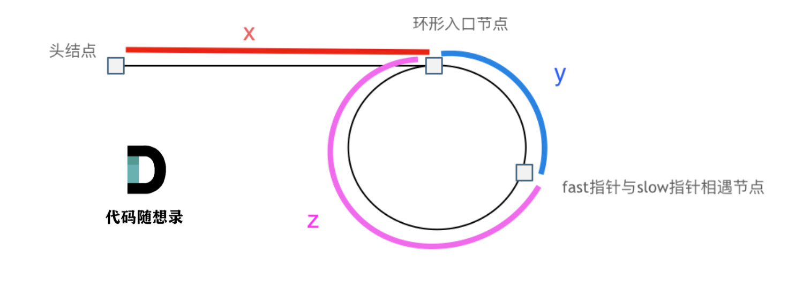

环形链表
核心：设置快慢两个指针，慢指针每次移动一位，快指针每次移动两位。
如果链表没有环结构，这两个指针永远也不会相遇
反之，如果有环结构，这两个指针一定会在某一处相遇
相对慢指针而言，快指针每次移动一位，所以永远也不会错过。
注意：相遇的地方不一定是入环处！！！

因此延伸出来几个变种题目： 1.是否有环 -> 返回值为 boolean 2.找出入环点 -> 返回值为 linkNode

1 很好理解，如果快慢指针在某一处相遇，直接返回 true，否则 false

2 在 1 的基础上，如果有环，从起点和相遇点分别出发两个指针，相遇的时候一定是环的入口

x 从起点到入环点的距离
y 从入环点到相遇点的距离
z 从相遇点回到入环点的距离

1 slow: x + y
2 fast: x + y + n(y+z);
2(x+y) = x+y+n(y+z), n>=1
x+y = n(y+z), n >= 1
待求解的是 x
x=(n-1)(y+z)+z, n>=1
当 n 等于 1 的时候，x=z，即从 head 和相遇点以同样的速度分别出发两个指针，一定会在入环处相遇
当 n 大于等于 1 的时候，即从 head 和相遇点以同样的速度分别出发两个指针，从 head 出发的指针在转了若干圈之后，仍然会和从相遇点出发的指针在入环处相遇

